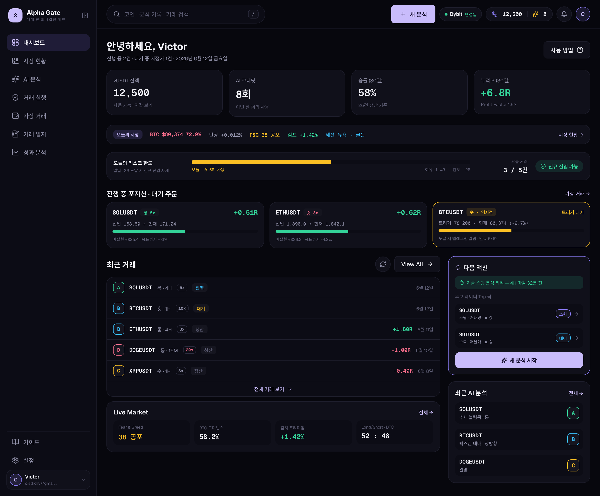
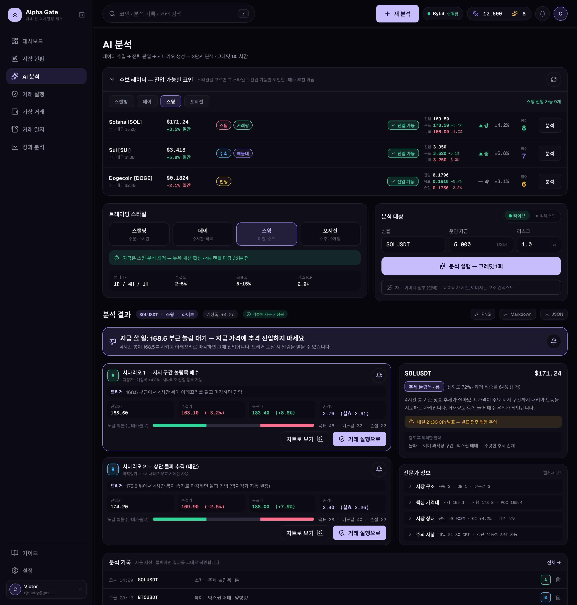
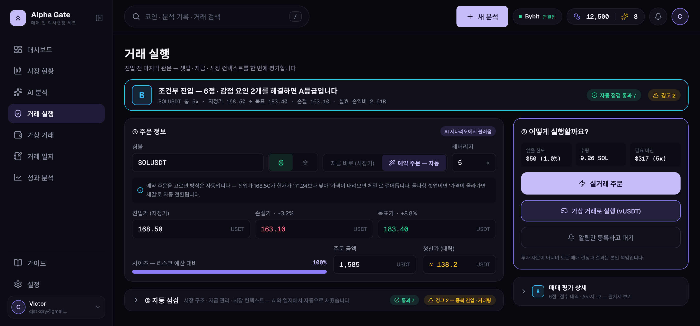
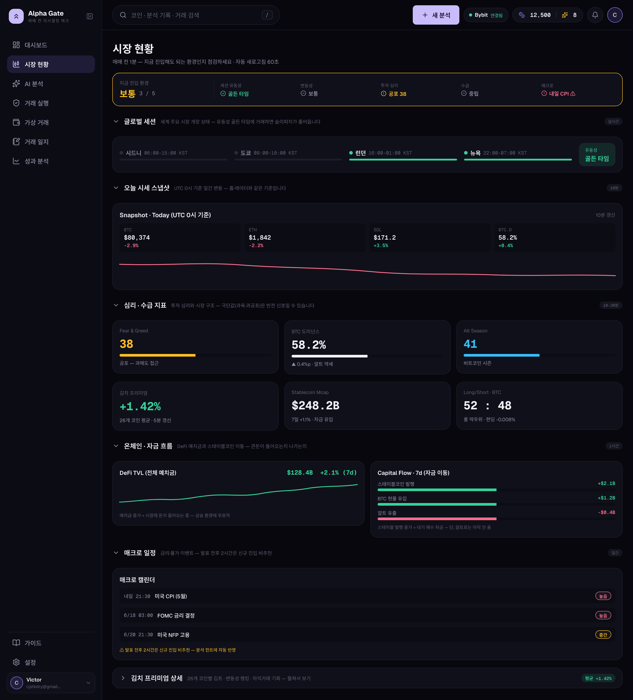
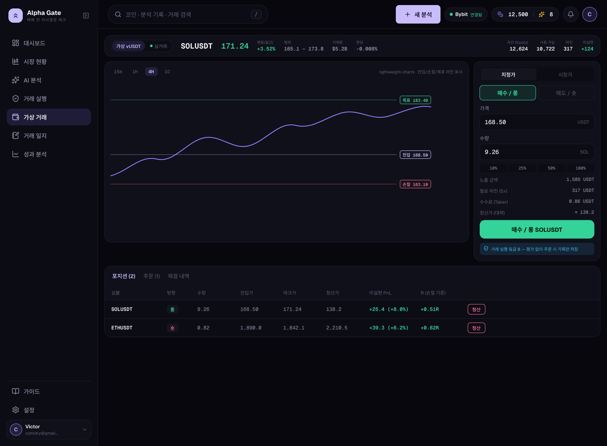
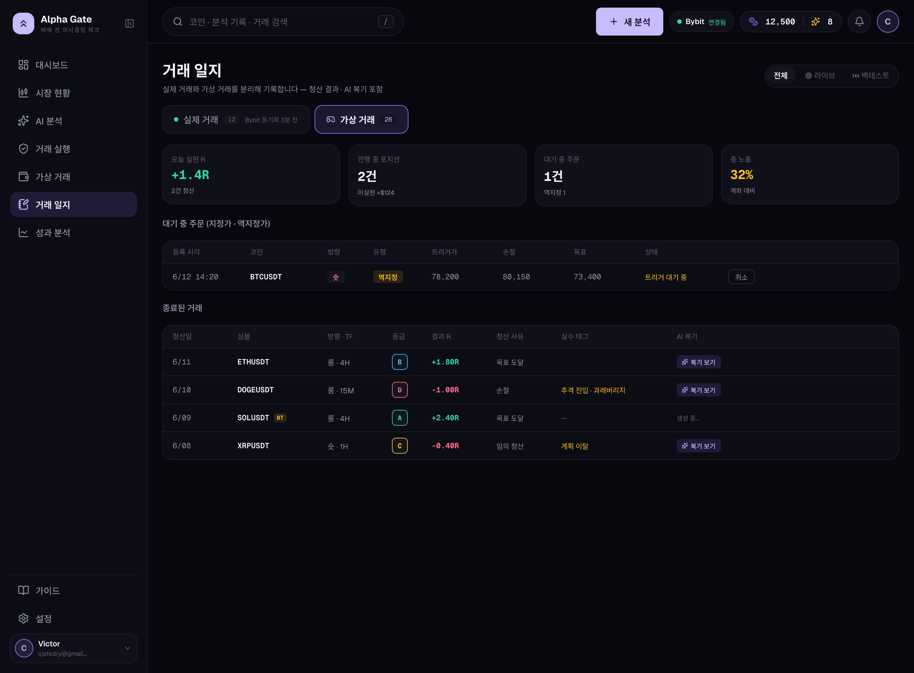
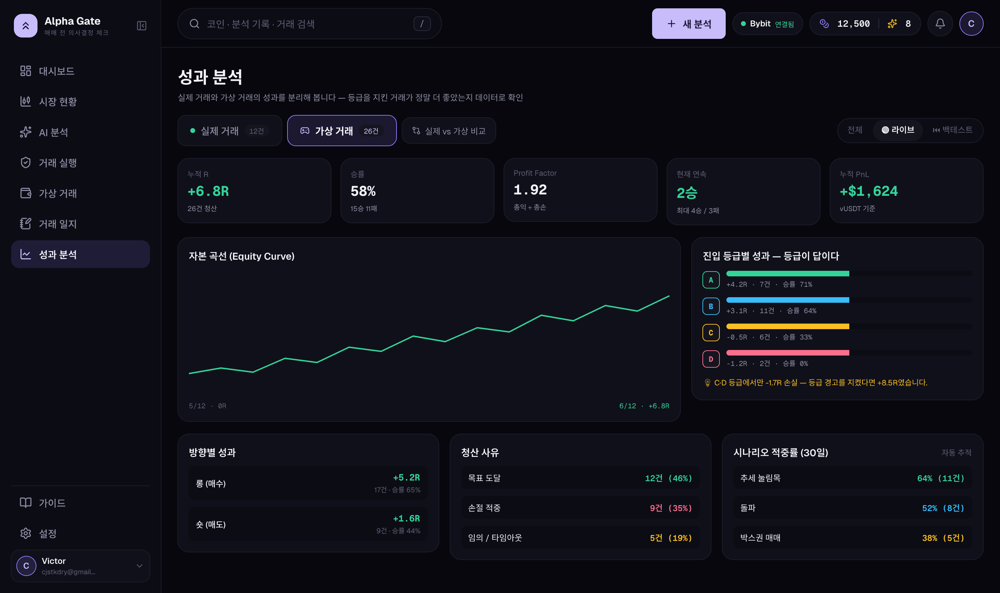
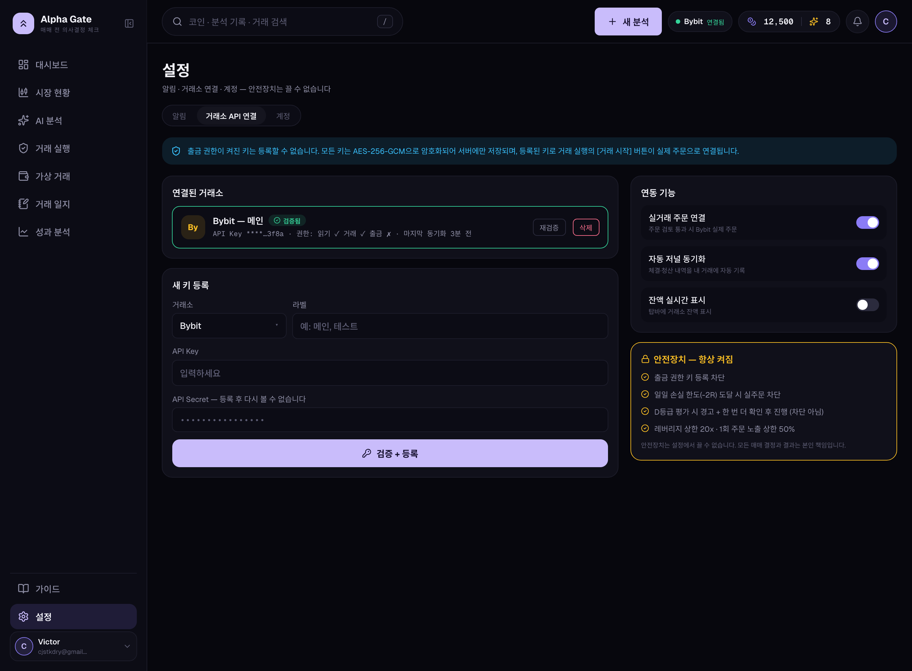

# Alpha Gate — UI 디자인 시안 (Pencil)

Pencil(`pencil-new.pen`)에서 추출한 확정 UI 디자인 목업. 바이올렛 다크 테마 + 접이식 사이드바.

## 디자인 토큰
- bg `#07070D` · card `#10101A`
- primary `#8B7CF6` · primary-soft(버튼) `#C9BCFB`
- success `#34D399` · error `#FB6E8C`
- 폰트: Geist / Geist Mono

## 네비게이션 (4글자 통일)
대시보드 / 시장 현황 / AI 분석 / 거래 실행 / 가상 거래 / 거래 일지 / 성과 분석 + 하단 가이드·설정

---

## 화면 (KO 데스크톱)

### 1. 대시보드

### 2. AI 분석

### 3. 거래 실행 (진입 점검)

### 4. 시장 현황

### 5. 가상 거래 (트레이딩 터미널)

### 6. 거래 일지

### 7. 성과 분석

### 8. 설정 · 거래소 API

---

## 비고
- 원본 .pen은 Pencil 에디터 전용(암호화). 활성 파일: `~/.antigravity-ide/extensions/highagency.pencildev-*/out/data/pencil-new.pen`
- 디자인 시스템 프레임(토큰·컴포넌트 모음)은 export 불가 요소가 있어 이미지 추출 제외 — 에디터에서 직접 확인.
- EN 데스크톱·모바일(KO/EN) 시안도 .pen에 존재. 필요 시 추가 추출.
- 관련 문서: [사용자 가이드](../docs/guide/사용자-가이드.md) · [시스템 상세](../docs/guide/시스템-상세.md)
